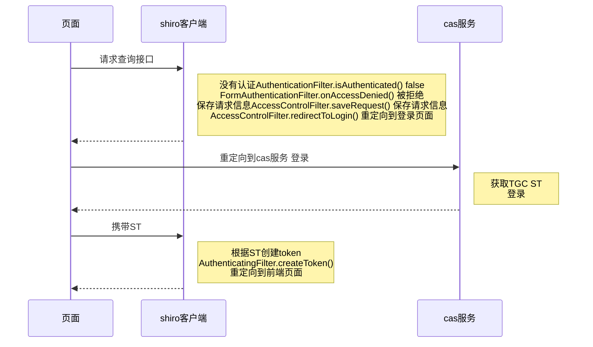
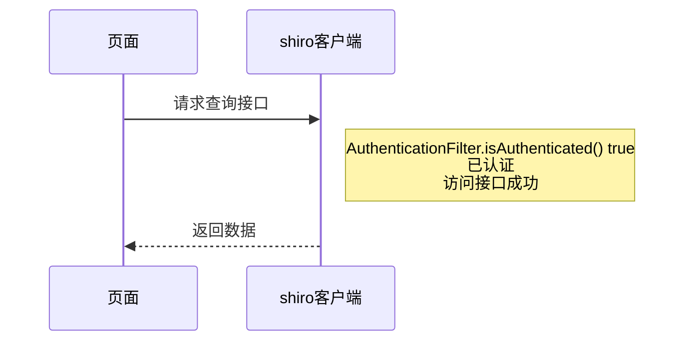

# shiro+cas 前后端分离 单点登录 解决方案

https://blog.csdn.net/JsongNeu/article/details/104643815

cas 服务器
https://github.com/jsong93/cas-server.git

# 写在前面
在设计开发自己的博客系统时，选择cas+shiro做用户认证和鉴权的框架，实现单点登录，方便接入其他系统。
曾经在徐州客户现场被cas折磨好久，一直想把cas啃下来。原谅我是个小菜鸟
搭建这个框架爬了很多坑，也参考了很多大佬的博客，自己慢慢试，跟踪源码，慢慢思考，也有一点收获。
目前项目还没有完成，可能还有很多坑，有很多地方处理的不是很好，现在只是流程通了，先记录下来，省着时间长忘了思路。也请各位大佬帮忙之处不对的地方

## 主要的重点
- 跨域问题
- 重定向
- sessionid的保持
- cookie的 domain和path

# cas服务
[cas服务端搭建](https://blog.csdn.net/JsongNeu/article/details/103343706)
[cas md5+盐加密](https://blog.csdn.net/JsongNeu/article/details/104227262)

# cas客户端
[spring boot cas+shiro环境搭建](https://blog.csdn.net/JsongNeu/article/details/104348404)

# 单点登录实现
shiroconfig配置
```java
package com.jsong.wiki.backend.config;

import com.jsong.wiki.backend.bean.ShiroUrl;
import com.jsong.wiki.backend.filter.MyAuthenticationFilter;
import com.jsong.wiki.backend.filter.MyFormAuthenticationFilter;
import com.jsong.wiki.backend.filter.MyUserFilter;
import com.jsong.wiki.backend.shiro.ShiroCasRealm;
import org.apache.shiro.cache.ehcache.EhCacheManager;
import org.apache.shiro.cas.CasFilter;
import org.apache.shiro.cas.CasSubjectFactory;
import org.apache.shiro.mgt.SecurityManager;
import org.apache.shiro.spring.LifecycleBeanPostProcessor;
import org.apache.shiro.spring.security.interceptor.AuthorizationAttributeSourceAdvisor;
import org.apache.shiro.spring.web.ShiroFilterFactoryBean;
import org.apache.shiro.web.filter.authc.LogoutFilter;
import org.apache.shiro.web.filter.authc.UserFilter;
import org.apache.shiro.web.mgt.DefaultWebSecurityManager;
import org.springframework.aop.framework.autoproxy.DefaultAdvisorAutoProxyCreator;
import org.springframework.beans.factory.annotation.Qualifier;
import org.springframework.context.annotation.Bean;
import org.springframework.context.annotation.Configuration;

import javax.servlet.Filter;
import java.util.HashMap;
import java.util.Map;
/**
 * shiro配置
 *
 * @Author: Jsong
 * @Date: 2020/2/7 21:58
 * @Description:
 */
@Configuration
public class ShiroConfig {

    // shiroFilter
    @Bean
    public ShiroFilterFactoryBean shiroFilter(SecurityManager securityManager,
                                              @Qualifier("casFilter") MyAuthenticationFilter casFilter,
//                                              @Qualifier("logoutFilter") LogoutFilter logoutFilter,
                                              @Qualifier("userFilter") MyUserFilter userFilter,
                                              MyFormAuthenticationFilter myFormAuthenticationFilter,
                                              ShiroUrl shiroUrl) {
        ShiroFilterFactoryBean shiroFilterFactoryBean = new ShiroFilterFactoryBean();
        shiroFilterFactoryBean.setSecurityManager(securityManager);
//        设置登录URL,当用户未认证,但访问了需要认证后才能访问的页面,就会自动重定向到登录URL
        shiroFilterFactoryBean.setLoginUrl(shiroUrl.getLoginUrl());
        shiroFilterFactoryBean.setSuccessUrl(shiroUrl.getSuccessUrl());
//        设置没有权限的URL,当用户认证后,访问一个页面却没有权限时,就会自动重定向到没有权限的URL,若用户未认证访问一个需要权限的URL时,会跳转到登录URL
        shiroFilterFactoryBean.setUnauthorizedUrl(shiroUrl.getUnauthorizedUrl());

        Map<String, Filter> filters = new HashMap<>();

//        org.apache.shiro.web.filter.mgt.DefaultFilter 包含所有的过滤器
        filters.put("casFilter", casFilter);
        filters.put("userFilter", userFilter);
        filters.put("authc", myFormAuthenticationFilter);
//        filters.put("logoutFilter", logoutFilter);
//        将Filter添加到Shiro过滤器链中,用于对资源设置权限
        shiroFilterFactoryBean.setFilters(filters);

        Map<String, String> filterChainDefinitionMap = new HashMap<String, String>();
        filterChainDefinitionMap.put(shiroUrl.getCasFilterUrlPattern(), "casFilter");
//        filterChainDefinitionMap.put(shiroUrl.getCasFilterUrlPattern(), "userFilter");
//        filterChainDefinitionMap.put(shiroUrl.getLogoutUrlPattern(), "logoutFilter");
        filterChainDefinitionMap.putAll(shiroUrl.getAuthUrlPatternMap());
        // 配置哪些请求需要受保护,以及访问这些页面需要的权限
        shiroFilterFactoryBean.setFilterChainDefinitionMap(filterChainDefinitionMap);
        return shiroFilterFactoryBean;
    }

    // 认证filter
    @Bean
    public MyAuthenticationFilter casFilter(ShiroUrl shiroUrl) {
        MyAuthenticationFilter casFilter = new MyAuthenticationFilter();
        // 登录成功url
        casFilter.setSuccessUrl(shiroUrl.getSuccessUrl());
        // 登录失败url
        casFilter.setFailureUrl(shiroUrl.getFailureUrl());
        return casFilter;
    }

  /***
   * 配置登录后重定向filter
   * @date 2020/2/29 20:41
   * @author Jsong
   * @param
   * @return com.jsong.wiki.backend.filter.MyUserFilter
   */
    @Bean
    public MyUserFilter userFilter(){
        return new MyUserFilter();
    }

    @Bean
    public MyFormAuthenticationFilter myFormAuthenticationFilter(){
        return new MyFormAuthenticationFilter();
    }

    // 自定义 casRealm
    @Bean
    public ShiroCasRealm casRealm(ShiroUrl shiroUrl, EhCacheManager ehCacheManager
    ) {
        ShiroCasRealm casRealm = new ShiroCasRealm();
        // cas服务器
        casRealm.setCasServerUrlPrefix(shiroUrl.getCas().getServerUrlPrefix());
        // 客户端地址，用于接收tiket
        casRealm.setCasService(shiroUrl.getCas().getService());
        casRealm.setCacheManager(ehCacheManager);
        return casRealm;
    }

    /**
     * 问题？？？？？
     * 把这个bean注入后，登录后就会重定向到登出，为什么呢？？？？？
     *
     * @param shiroUrl
     * @return
     */
//    @Bean
    public LogoutFilter logoutFilter(ShiroUrl shiroUrl) {
        LogoutFilter logoutFilter = new LogoutFilter();
        // 登出后重定向地址
        logoutFilter.setRedirectUrl(shiroUrl.getLogoutUrl());
        return logoutFilter;
    }

    @Bean
    public EhCacheManager ehCacheManager() {
        EhCacheManager ehCacheManager = new EhCacheManager();
        ehCacheManager.setCacheManagerConfigFile("classpath:config/ehcache-shiro.xml");
        return ehCacheManager;
    }

    //    配置securityManager SecurityManager,Shiro的安全管理，主要是身份认证的管理，缓存管理，cookie管理
    @Bean
    public SecurityManager securityManager(ShiroCasRealm casRealm, EhCacheManager ehCacheManager
    ) {
        DefaultWebSecurityManager securityManager = new DefaultWebSecurityManager();
        securityManager.setSubjectFactory(new CasSubjectFactory());
        securityManager.setCacheManager(ehCacheManager);
        securityManager.setRealm(casRealm);
        return securityManager;
    }

    //    配置lifecycleBeanPostProcessor,shiro bean的生命周期管理器,可以自动调用Spring IOC容器中shiro bean的生命周期方法(初始化/销毁)
//    @Bean
    public LifecycleBeanPostProcessor lifecycleBeanPostProcessor() {
        return new LifecycleBeanPostProcessor();
    }

    /*    为了支持Shiro的注解需要定义DefaultAdvisorAutoProxyCreator和AuthorizationAttributeSourceAdvisor两个bean
        配置DefaultAdvisorAutoProxyCreator,必须配置了lifecycleBeanPostProcessor才能使用*/
//    @DependsOn("lifecycleBeanPostProcessor")
//    @Bean
    public DefaultAdvisorAutoProxyCreator defaultAdvisorAutoProxyCreator() {
        DefaultAdvisorAutoProxyCreator defaultAdvisorAutoProxyCreator = new DefaultAdvisorAutoProxyCreator();
        return defaultAdvisorAutoProxyCreator;
    }

    //    配置AuthorizationAttributeSourceAdvisor
    @Bean
    public AuthorizationAttributeSourceAdvisor authorizationAttributeSourceAdvisor(SecurityManager securityManager) {
        AuthorizationAttributeSourceAdvisor authorizationAttributeSourceAdvisor = new AuthorizationAttributeSourceAdvisor();
        authorizationAttributeSourceAdvisor.setSecurityManager(securityManager);
           return authorizationAttributeSourceAdvisor;
    }
}

```

- 重写CasFilter onAccessDenied方法
解决的问题
	
		请求重定向返回cas登录页面的字符串
		前端重定向，开启了一个新的session，shiro无法通过上次请求保存的saverequest中获取请求的uri，以至登录成功后，无法返回请求的页面
		
非前后端分离的项目，当请求一个需要权限的方法时，需要servlet可以直接重定向到cas登录页面

---
## 重定向问题
前后端分离的项目，当使用ajax请求一个需要权限的方法时，也会重定向，但会直接将重定向的cas登录页面以字符串的方式返回

**解决办法**

重写FormAuthenticationFilter的onAccessDenied方法，通过subject.isAuthenticated()判断是否登录，如果未登录返回给前端401，前端在重定向到cas登录页面
```java
package com.jsong.wiki.backend.filter;

import com.jsong.wiki.backend.bean.CookieProperties;
import lombok.extern.log4j.Log4j2;
import org.apache.shiro.SecurityUtils;
import org.apache.shiro.subject.Subject;
import org.apache.shiro.web.filter.authc.FormAuthenticationFilter;
import org.apache.shiro.web.util.WebUtils;
import org.springframework.beans.factory.annotation.Autowired;
import org.springframework.beans.factory.annotation.Value;
import org.springframework.stereotype.Component;

import javax.servlet.ServletRequest;
import javax.servlet.ServletResponse;
import javax.servlet.http.Cookie;
import javax.servlet.http.HttpServletRequest;
import javax.servlet.http.HttpServletResponse;
import java.io.IOException;

/**
 * authc 的过滤器
 *
 * @Author: Jsong
 * @Date: 2020/3/2 22:24
 * @Description:
 */

//@Component
@Log4j2
public class MyFormAuthenticationFilter extends FormAuthenticationFilter {

    @Value("${shiro.loginUrl}")
    private String loginUrl;
    @Value("${front.url}")
    private String frontUrl;

    //    protected void saveRequestAndRedirectToLogin(ServletRequest request, ServletResponse response) throws IOException {
//        log.info("-----------------redirect login --------------------");
//        Cookie cookie = new Cookie("front-url", ((HttpServletRequest) request).getHeader("front-url"));
//        ((HttpServletResponse) response).addCookie(cookie);
//        saveRequest(request);
//        redirectToLogin(request, response);
//    }
    @Autowired
    private CookieProperties cookieProperties;

    /***
     *重写登录重定向
     * 把请求内容存入cookie，重定向的时候带着cookie保存状态
     * @date 2020/3/3 14:46
     * @author Jsong
     * @param request
     * @param response
     * @return boolean
     */
    @Override
    protected boolean onAccessDenied(ServletRequest request, ServletResponse response) throws Exception {
        if (isLoginRequest(request, response)) {
            if (isLoginSubmission(request, response)) {
                if (log.isTraceEnabled()) {
                    log.trace("Login submission detected.  Attempting to execute login.");
                }
                return executeLogin(request, response);
            } else {
                if (log.isTraceEnabled()) {
                    log.trace("Login page view.");
                }
                //allow them to see the login page ;)
                return true;
            }
        } else {
            if (log.isTraceEnabled()) {
                log.trace("Attempting to access a path which requires authentication.  Forwarding to the " +
                        "Authentication url [" + getLoginUrl() + "]");
            }
            log.info("-----------------redirect login --------------------");


//            Cookie[] cookies = ((HttpServletRequest) request).getCookies();
//            for (Cookie cookie : cookies) {
//                cookie.setDomain(cookieProperties.getDomain());
//                cookie.setPath(cookieProperties.getPath());
//                cookie.setHttpOnly(cookieProperties.getHttpOnly());
//            }

//            Cookie cookie = new Cookie(frontUrl, ((HttpServletRequest) request).getHeader(frontUrl));
//            cookie.setDomain(cookieProperties.getDomain());
//            cookie.setPath(cookieProperties.getPath());
//            cookie.setHttpOnly(cookieProperties.getHttpOnly());
//            ((HttpServletResponse) response).addCookie(cookie);

//            saveRequestAndRedirectToLogin(request, response);
            saveRequest(request);
//            redirectToLogin(request, response);
            // 读取到的 /index.jsp 不知道为啥
//            String loginUrl = getLoginUrl();

//            shiro 会把请求内容保存起来，未登录为空
//            if(WebUtils.getSavedRequest(request)==null){
//                // 未授权，返回前端状态401 进行重定向
//            request里获取不到用户信息，不能通过request判断是否登录，不能用这个方法了
//            ((HttpServletResponse) response).setStatus(HttpServletResponse.SC_UNAUTHORIZED);
//            return false;
//            }
            Subject subject = SecurityUtils.getSubject();
            if (!subject.isAuthenticated()) {
                // 未授权，返回前端状态401 进行重定向
                ((HttpServletResponse) response).setStatus(HttpServletResponse.SC_UNAUTHORIZED);
                return false;
            }
            // ajax 重定向会返回html页面字符串
            WebUtils.issueRedirect(request, response, loginUrl);
            return false;
        }
    }
}

```
```js
/*
 * @Descripttion:
 * @version:
 * @Author: jsong
 * @Date: 2020-02-25 22:30:54
 * @LastEditors: jsong
 * @LastEditTime: 2020-03-07 12:04:18
 */

import axios from "axios";
import Cookies from "js-cookie";

axios.defaults.withCredentials = true;
const baseUrl = "/blog-backend";
export const api = axios.create({
  // headers: { "Access-Control-Allow-Origin": "http://127.0.0.1:28080" },
  // baseUrl
});
api.interceptors.request.use(
  req => {
    req.withCredentials = true;
    console.log("req", req);

    // Cookies.set(
    //   "api-uri",
    //   req.url.indexOf(baseUrl) > -1 ? req.url.substr(13) : null
    // );
    Cookies.set("front-url", window.location.href);
    // req.headers["api-uri"] =
    //   req.url.indexOf(baseUrl) > -1 ? req.url.substr(13) : null;
    // req.headers["front-url"] = window.location.href;
    return req;
  },
  err => {
    console.log("e", err);
    if (401 === err.request.status) {
    }
  }
);

api.interceptors.response.use(
  res => {
   // if (res && res.request) {
    //  const responseURL = res.request.responseURL;
    //  if (
   //     responseURL ===
   //     "http://127.0.0.1:18080/cas/login?service=http://127.0.0.1:18081/blog-backend/shiro-cas"
   //   ) {
        // const jsessionid = Cookies.get("JSESSIONID");
        // console.log("jssionid", jsessionid);
        // localStorage.setItem("jsessionid", jsessionid);
        // window.location.href = `${responseURL}&test=1`;
    //    window.location.href = `${responseURL}`;
   //   }
      // console.log("cookie", document.cookie);
    //  return res;
    // }
    return res;
  },
  err => {
    console.log("e", err);
    if (401 === err.response.status) {
      const jsessionid = Cookies.get("JSESSIONID");
      console.log("jssionid", jsessionid);
      localStorage.setItem("jsessionid", jsessionid);
      window.location.href =
        "http://127.0.0.1:18080/cas/login?service=http://127.0.0.1:18081/blog-backend/shiro-cas";
    }
  }
);


```

## sessionid丢失问题
用于用户登录成功后，重定向到前端页面
前后端不分离的项目请求的时候，uri会被shiro保存，登录验证成功后，通过sessionid获取uri，返回原来的uri
但是前后端分离后，前端新打开一个cas登录页面，sessionid丢失，不能再获取上次请求的uri了。

**解决办法**
1. 这是个思路，我没实现，前端通过cookie获取sessionid，然后保存到localStorage中，重定向到cas登录页面后再重localStorage中获取sessionid，试了一下但是后来发现要cas的登录页面，就放弃了。
2. 前端发送请求的时候在cookie中加入 前端url的信息，在登录成功后获取cookie信息，重定向到前端页面


重写onAccessDenied的方法
/shiro-cas的过滤器，用于接收cas发放的ticket


```java
package com.jsong.wiki.backend.filter;

import lombok.extern.log4j.Log4j2;
import org.apache.shiro.cas.CasFilter;
import org.apache.shiro.web.servlet.ShiroHttpServletRequest;
import org.apache.shiro.web.util.SavedRequest;
import org.apache.shiro.web.util.WebUtils;
import org.springframework.beans.factory.annotation.Value;

import javax.servlet.ServletRequest;
import javax.servlet.ServletResponse;
import javax.servlet.http.Cookie;
import javax.servlet.http.HttpServletRequest;

/**
 * casfilter过滤器
 *
 * @Author: Jsong
 * @Date: 2020/2/27 21:58
 * @Description:
 */
//@Component
@Log4j2
public class MyAuthenticationFilter extends CasFilter {

    //    @Value("${front.baseUrl}")
//    private String frontBaseUrl;
    @Value("{shiro.loginUrl}")
    private String loginUrl;
    @Value("${front.url}")
    private String frontUrl;
    @Value("${api.uri}")
    private String apiUri;

    private String test = "http://127.0.0.1:28080/#";

//    @Autowired
//    private MyFormAuthenticationFilter myFormAuthenticationFilter;

    /***
     *登录过的用户重定向到请求的controller
     * 第一次登录的用户重定向到前端地址
     * @date 2020/3/3 21:00
     * @author Jsong
     * @param request
     * @param response
     * @return void
     */
    @Override
    protected void issueSuccessRedirect(ServletRequest request, ServletResponse response) throws Exception {
//        String originalUrl = ((ShiroHttpServletRequest) request).getHeader(apiUri);

        // 不再重hearder中获取，改为重cookie中获取
        String originalUrl = null;
//        String api_uri = null;
//        String front_url = null;

        Cookie[] cookies = ((HttpServletRequest) request).getCookies();
        if (cookies != null) {
            for (Cookie cookie : cookies) {
//                if (apiUri.equals(cookie.getName())) {
//                    api_uri = cookie.getValue();
//                } else if (frontUrl.equals((cookie.getName()))) {
//                    front_url = cookie.getValue();
//                }
                if (frontUrl.equals((cookie.getName()))) {
//                    front_url = cookie.getValue();
                    originalUrl = cookie.getValue();
                }
            }
            // 重定向到api 或者前端页面
//            originalUrl = api_uri != null ? api_uri : front_url;
        }

//        SavedRequest savedRequest = WebUtils.getAndClearSavedRequest(request);
//        if (originalUrl == null || "".equals(originalUrl)) {
//            // 重cookie中获取上次请求的地址，登录成功后，重定向到前端
//            Cookie[] cookies = ((ShiroHttpServletRequest) request).getCookies();
//
//            if (cookies != null) {
//                for (Cookie cookie : cookies) {
//                    if (frontUrl.equals(cookie.getName())) {
//                        // 神奇的问题
////                    originalUrl = frontBaseUrl+ cookie.getValue();
////                    originalUrl = "http://127.0.0.1:28080/#"+ cookie.getValue();
////                    originalUrl = frontBaseUrl + "/blog-edit";
////                    originalUrl = test + cookie.getValue();
////                    originalUrl = "http://127.0.0.1:28080/#/";
//                        originalUrl = cookie.getValue();
//                        log.info("originalUrl:" + originalUrl);
//                    }
//                }
//            }

//        String requestUri = savedRequest.getRequestURI();
//        String redirectUrl = null;
//        String[] requestArray = requestUri.split("/blog-backend");
//        if(requestArray!=null&&requestArray.length>1){
//            redirectUrl = requestArray[1];
//        }
        log.info(originalUrl);
        try {
            WebUtils.redirectToSavedRequest(request, response, originalUrl);
        } catch (Exception e) {
            log.error(e.getStackTrace());
        }

//        }
    }


}


}


```

## 时序图
用户未登录

用户已登录

## 测试
在csdn模仿简书 还是简书好看 哈哈哈 


## 遇到一个奇怪的问题
登录成功后重定向到前端的url是字符串时，下次访问不会再去cas server重新认证
当url是@Value获取的值时，下次访问会到cas server重新认证
[详细问题](https://blog.csdn.net/JsongNeu/article/details/104711038)